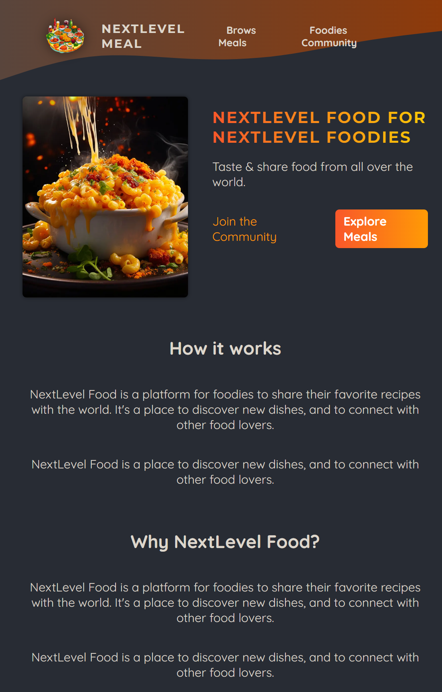
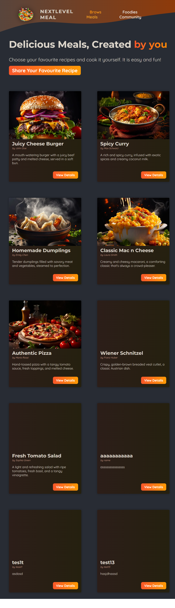
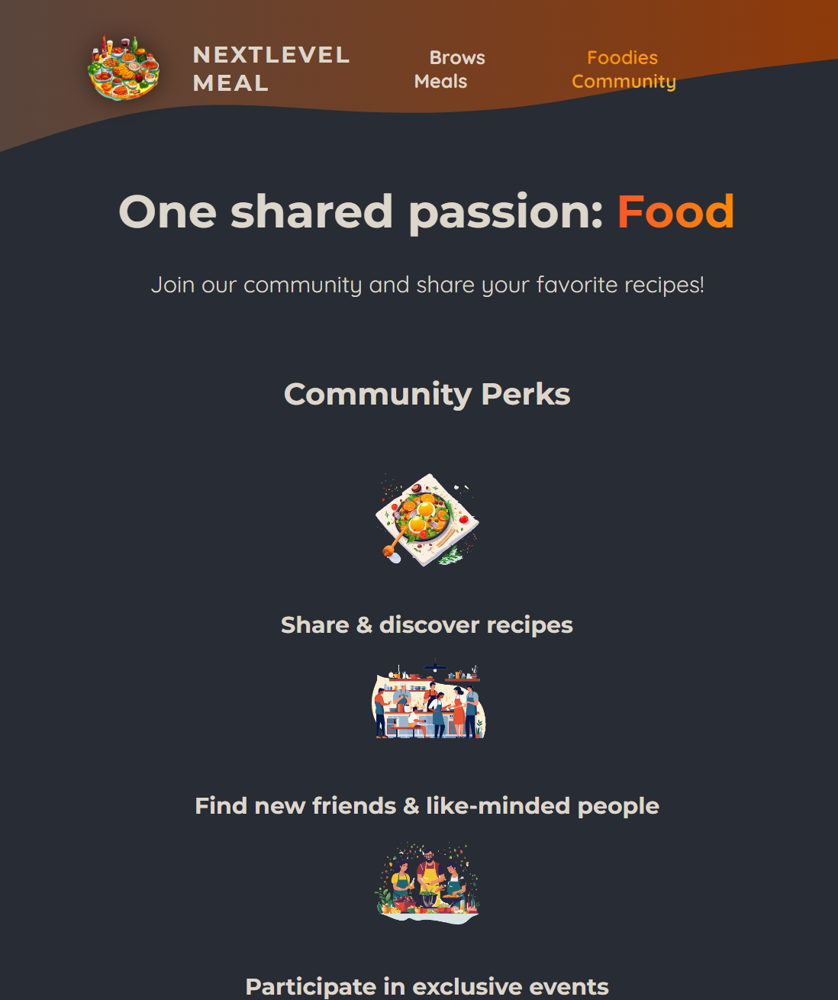
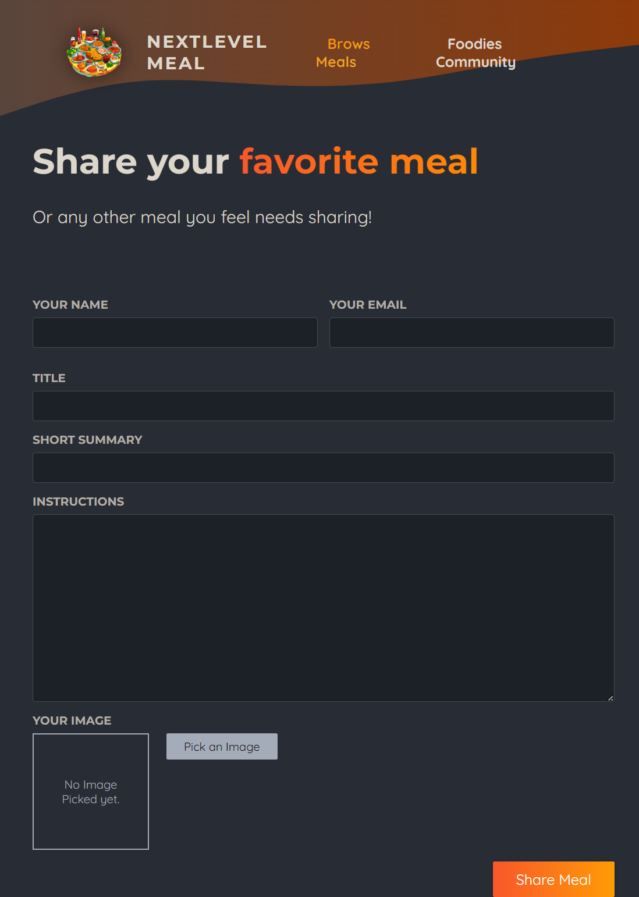
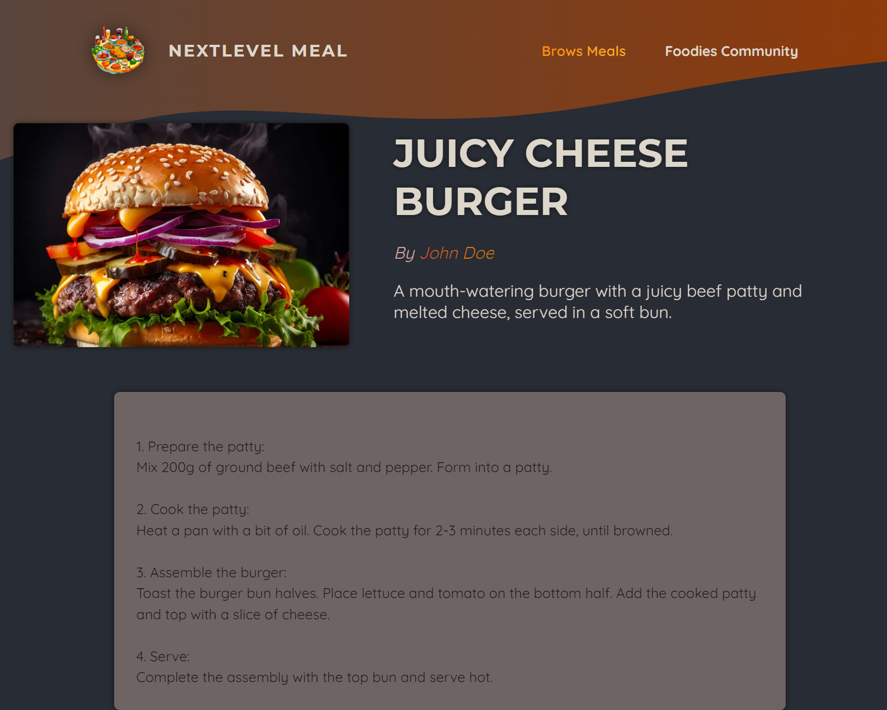

# Meal Website
Next Js Website let you explore recipes of Meals and Share yours
## Features
* Next js app router
* sqlite for saving meals
* module.css for styling
### Screens

#### Install
* downlaod the file
* npm install
* npm run dev
* npm run build and then npm start for production
